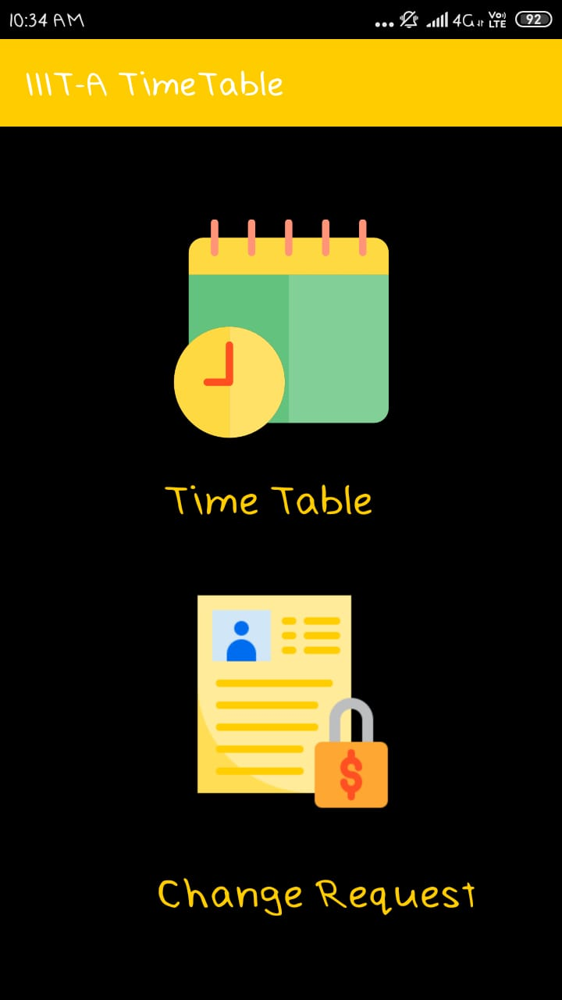
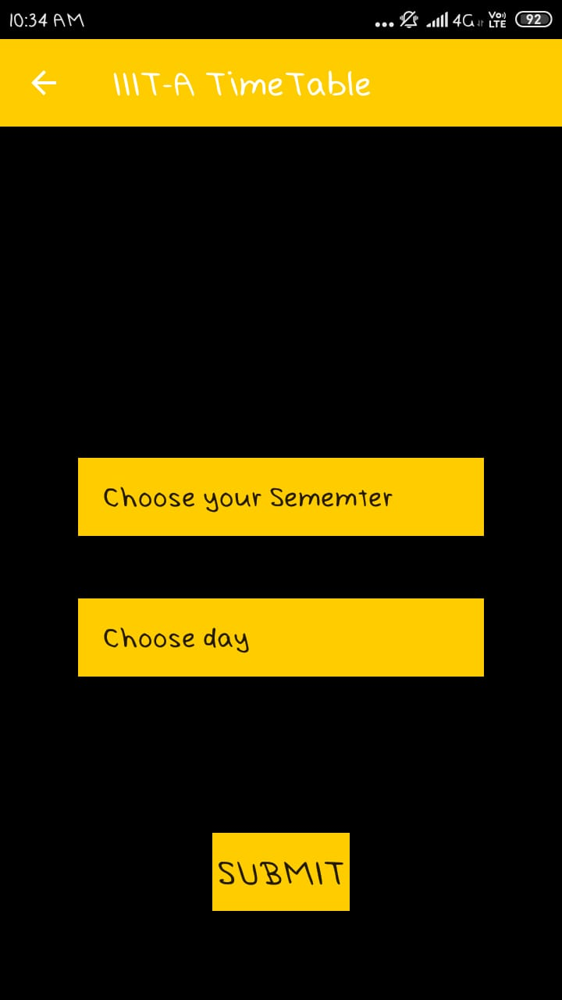
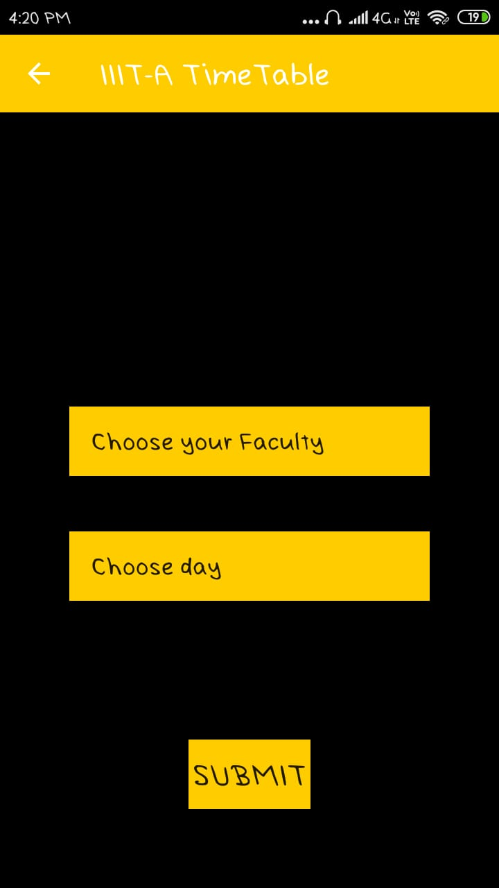
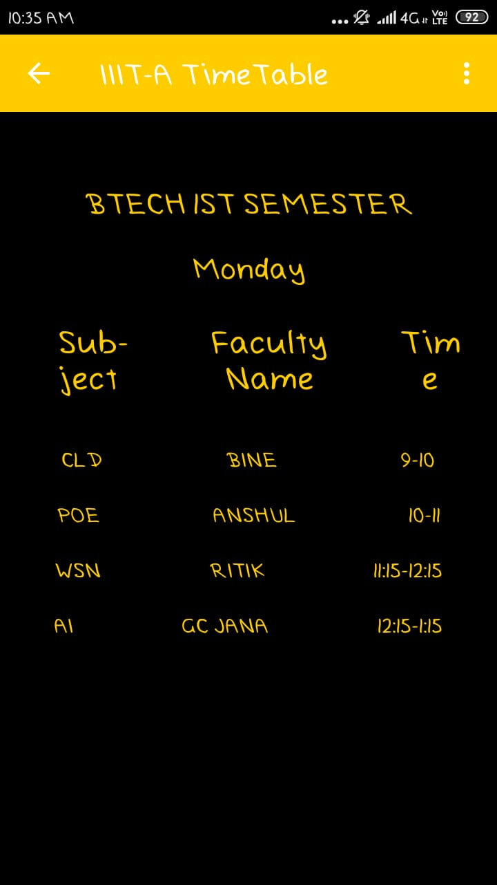

# Time-Table-Management-Android-Application

"Time Table Management" android application is used to display time-table for the students as well as faculties. Also, it creates a space for Faculties for scheduling the classes, providing important announcements without any collisions and making requests for the change in the time table.

## Working

It is having three types of users, i.e. Admin, Student, and Faculty. 
Admin can grant requests made by the faculties. Students can access the the timetable of both students as well as faculties.
Faculties can make a request for the change in the time table, as well as they can add new announcements for the students in the notification channel.

## Tech Stack

Android Studio, Firebase Database

## Set up Android SDK
Place your Android SDK somewhere in your home directory or some other application-independent location. Some distributions of IDEs include the SDK when installed, and may place it under the same directory as the IDE. 
Set-up of an SDK can be done with the following steps-.<br/.
1) Download the application in a zip format from the repository. 
2) Extract the application at a particular known path. 
3) In Android Studio, go to the file dropdown option on the top menu in the android window. 
4) In the file dropdown, choose “Open” the project to open the downloaded project. 
5) Select the Timetable directory that you downloaded recently. 
6) If you get any error in the form of a yellow text box at the top of the editor window. 
7) Then, you need to install the required SDK. This can be done by clicking on the “File” dropdown followed by clicking on the “Project Structure”. Select SDK from the list on the right hand side.  
8) Choose “Android Nougat” under the SDK platform option. 
9) In the “Module” option,upload the SDK jar file by clicking on the option “include jar file”. 
10) Select the the previously added SDK jar file in the “SDK tools” option to set up the SDK for the project. 

## Instuctions to Run
1) After the SDK setup of the required project, click on the “Build” dropdown in the top menu. 
2) Select “Make project” option to build the project. On successful compilation of the project you will get “Build syncing successful” message in the build terminal at the bottom of the window of android studio.” 
3) After this, click on “Right green arrow” at the upper right most side of the window of android studio to run the project. 
4) Optional- If you encounter any error related to SDK installation then, then to the file dropdown, choose “Project structure” go the SDK part and install the required packages by clicking on the checkboxes and then click on “Apply” and “OK” at the bottom of the pop up window. 
5) “Run successfully” will be displayed after the application is executed successfully. 

## App Interface

## More
More details on the project can be found in the documentation present inside the repo. Check out the SRS{Software Requirement Specifications) for more.
